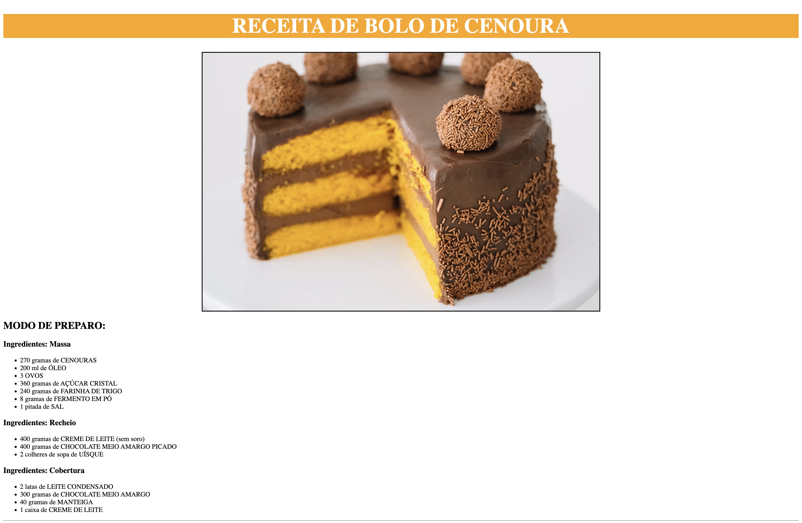

# Landing Page - RECEITA

# BOLO DE CENOURA

## Indicação de uma receita prática para um bom café da tarde. 
#### O objetivo desse projeto é colocar em prática os conhecimentos adquiridos sobre linguagem de marcação, durante o curso de desenvolvimento de sistemas do [SENAI Jandira] https://sp.senai.br/unidade/jandira/

---
## Tecnologias utilizadas

- HTML
- CSS
- MarkDown
- Git

---

## Autor

- [Daniel Torres](https://www.linkedin.com/in/daniel-torres-007a54217/)
